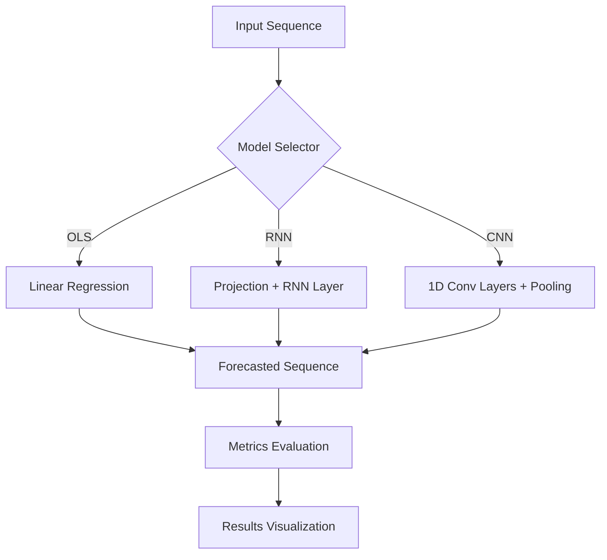
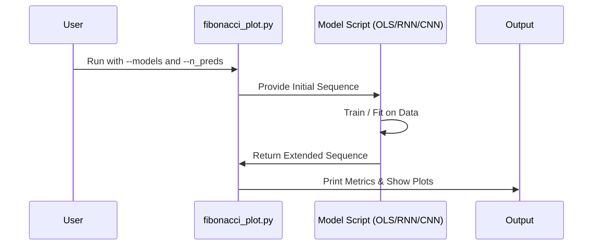

# Fibonacci Sequence Forecasting: A Comparative Study of OLS, RNN, and CNN

## Executive Summary
This repository presents a comparative analysis of three distinct mathematical and machine learning approaches for forecasting the Fibonacci sequence. By evaluating a classical **Ordinary Least-Squares (OLS)** regression against deep learning architectures—specifically a **Recurrent Neural Network (RNN)** and a **1D Convolutional Neural Network (CNN)**—this project highlights the strengths and limitations of various modeling paradigms when applied to deterministic linear recurrences.

## Project Overview
The Fibonacci sequence, defined by the recurrence relation $F_n = F_{n-1} + F_{n-2}$, serves as a perfect benchmark for time-series forecasting models. While the sequence is inherently deterministic, it provides a clear baseline to test how well neural networks can approximate simple mathematical rules compared to direct statistical estimation.

### Key Models
| Model | Paradigm | Core Mechanism | Strengths |
|-------|----------|----------------|-----------|
| **OLS Regression** | Statistical | Linear combination of $F_{t-1}$ and $F_{t-2}$ | Instant training, perfect accuracy for linear rules. |
| **RNN + Projection** | Deep Learning | Sequential state memory with a projection layer | Captures temporal dependencies across variable lengths. |
| **1D CNN** | Deep Learning | Local pattern recognition via sliding kernels | Efficient parallel processing of local sequence windows. |

---

## Model Architectures

### 1. Ordinary Least-Squares (OLS)
The OLS model treats the problem as a simple linear regression task:
$$F_t = \beta_1 F_{t-1} + \beta_2 F_{t-2} + \epsilon$$
Given the deterministic nature of the sequence, OLS quickly identifies the weights $\beta_1 \approx 1$ and $\beta_2 \approx 1$ with near-zero intercept.

### 2. Recurrent Neural Network (RNN)
The RNN implementation utilizes a scalar input passed through a 4-dimensional projection layer, followed by a hidden layer of 10 units. This architecture allows the model to maintain a hidden state, theoretically enabling it to learn the recursive addition rule over time.

### 3. 1D Convolutional Neural Network (CNN)
The CNN approach uses two layers of 1D convolutions followed by global average pooling. By sliding filters over a fixed-size window (e.g., the last 4 numbers), the CNN learns to extract local features that represent the "add-two-previous" rule.

---

## Installation & Setup

### Prerequisites
- Python 3.8+
- `pip` (Python package manager)

### Installation
Clone the repository and install the required dependencies:
```bash
git clone https://github.com/your-repo/fibonacci-showdown.git
cd fibonacci-showdown
pip install -r requirements.txt
```

---

## Usage
The main entry point for comparing the models is the `fibonacci_plot.py` script.

### Running the Comparison
To execute all models and view the forecasted sequences:
```bash
python3 scripts/fibonacci_plot.py --models all --n_preds 5
```

### Options
- `--models`: Choose between `ols`, `rnn`, `cnn`, or `all`.
- `--n_preds`: Number of future Fibonacci steps to forecast (default: 5).
- `--plot`: (Optional) Display graphical comparisons using Matplotlib.

---

## Conclusion
The results of this study demonstrate a clear hierarchy of efficiency for this specific problem:

1.  **Classic Statistics Over Neural Networks:** For deterministic linear recurrences like the Fibonacci sequence, OLS is the superior tool. It achieves perfect precision in sub-millisecond time by directly solving the underlying linear equation.
2.  **The Role of Deep Learning:** While the RNN and CNN models successfully learn the sequence, they require significant computational overhead (training epochs) to approximate a rule that OLS identifies instantly. Deep learning remains essential for non-linear, high-dimensional, or noisy datasets where an explicit mathematical rule is unknown.
3.  **Architectural Insights:** The CNN's ability to parallelize over windows makes it efficient for pattern recognition, while the RNN's hidden state is better suited for longer-range temporal dependencies.

In summary, this project serves as a reminder to **start with simple baselines**. When the "ground truth" is a linear combination of previous states, classic statistical methods are often unbeatable in both speed and accuracy.

---

## Visualizations

### System Architecture


### Data Flow

